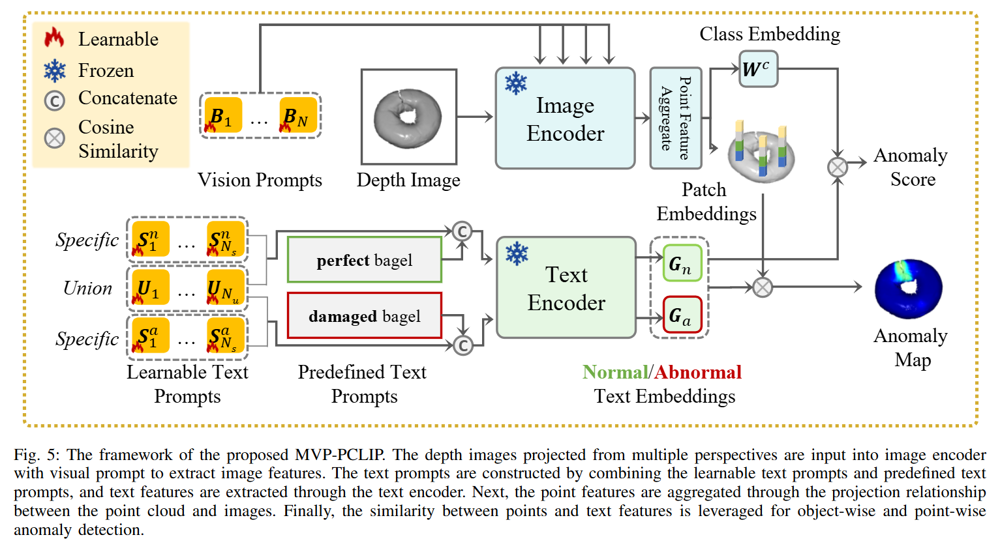
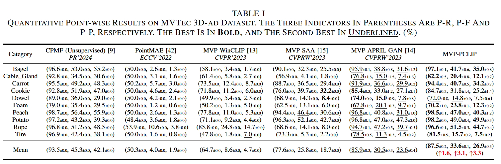
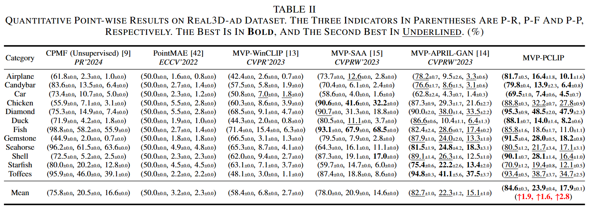
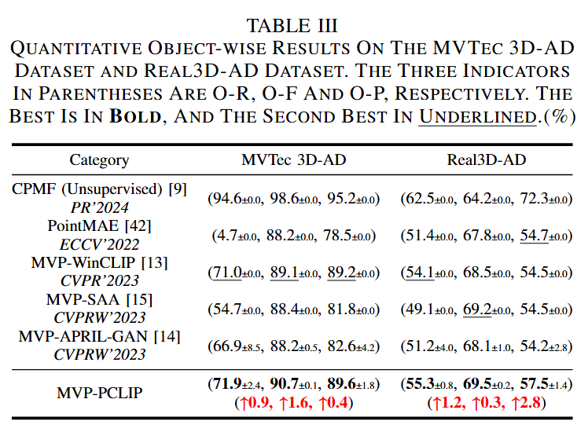

# MVP-PCLIP (Zero-Shot Point Cloud Anomaly Detection)


> [**IEEE TSMC Under Review**] [**Towards Zero-shot Point Cloud Anomaly Detection: A Multi-View Projection Framework**](https://export.arxiv.org/abs/2409.13162).
>
> by [Yuqi Cheng*](https://hustcyq.github.io/), [Yunkang Cao*](https://caoyunkang.github.io/), [Guoyang Xie](https://guoyang-xie.github.io/), Zhichao Lu, [Weiming Shen](https://scholar.google.com/citations?user=FuSHsx4AAAAJ&hl=en),

## Introduction 
Detecting anomalies within point clouds is crucial for various industrial applications, but traditional unsupervised methods face challenges due to data acquisition costs, early-stage production constraints, and limited generalization across product categories. To overcome these challenges, we introduce the Multi-View Projection (MVP) framework, leveraging pre-trained Vision-Language Models (VLMs) to detect anomalies. Specifically, MVP projects point cloud data into multi-view depth images, thereby translating point cloud anomaly detection into image anomaly detection. Following zero-shot image anomaly detection methods, pre-trained VLMs are utilized to detect anomalies on these depth images. Given that pre-trained VLMs are not inherently tailored for zero-shot point cloud anomaly detection and may lack specificity, we propose the integration of learnable visual and adaptive text prompting techniques to fine-tune these VLMs, thereby enhancing their detection performance. Extensive experiments on the MVTec 3D-AD and Real3D-AD demonstrate our proposed MVP framework's superior zero-shot anomaly detection performance and the prompting techniques' effectiveness. Real-world evaluations on automotive plastic part inspection further showcase that the proposed method can also be generalized to practical unseen scenarios.

## Overview of MVP-PCLIP


## 🛠️ Getting Started

### Installation
To set up the MVP-PVLIP environment, follow one of the methods below:

- Clone this repo:
  ```shell
  git clone https://github.com/hustCYQ/MVP-PCLIP.git && cd MVP-PCLIP
  ```
- Construct the experimental environment, follow these steps:
  ```shell
  conda create -n PCLIP python=3.9.5 -y
  conda activate PCLIP
  pip install -r requirements.txt
  ```


### Dataset Preparation 
You can choose to download **original** datasets and process them according to **Preprocess**. You are also welcome to directly download our **processed** datasets. All datasets need to be placed in your `DATA_ROOT`. 

| Dataset | Google Drive | Baidu Drive | Note
|------------|------------------|------------------| ------------------|
| MVTec3D    | [Google Drive]() | [Baidu Drive]() | Original |
| Real3D    | [Google Drive]() | [Baidu Drive]() | Original |
| MVTec3D-multiview    | [Google Drive]() | [Baidu Drive]() | Processed |
| Real3D-multiview    | [Google Drive]() | [Baidu Drive]() | Processed |


### Preprocess
#### MVTec3D
We remove the background and project point clouds to multi_view images.
```
sh process_MVTec3D.sh
```

#### Real3D
We first convert Real3D to Depth data **.tiff file**, and then project point clouds to multi_view images.
```
sh process_Real3D.sh
```

### Train & Test
```
python run_exps.py
```

## Main Results

### 1. Point-wise on MVTec 3D


### 2. Point-wise on Real3D


### 3. Object-wise both on MVTec 3D and Real3D


## 💘 Acknowledgements
Our work is largely inspired by the following projects. Thanks for their admiring contribution.

- [VAND-APRIL-GAN](https://github.com/ByChelsea/VAND-APRIL-GAN)
- [CPMF](https://github.com/caoyunkang/CPMF)


## Citation

If you find this project helpful for your research, please consider citing the following BibTeX entry.

```BibTex

@inproceedings{PCLIP,
  title={Towards Zero-shot Point Cloud Anomaly Detection: A Multi-View Projection Framework},
  author={Yuqi Cheng, Yunkang Cao, Guoyang Xie, Zhichao Lu, Weiming Shen},
  booktitle={},
  year={2024}
}

```


